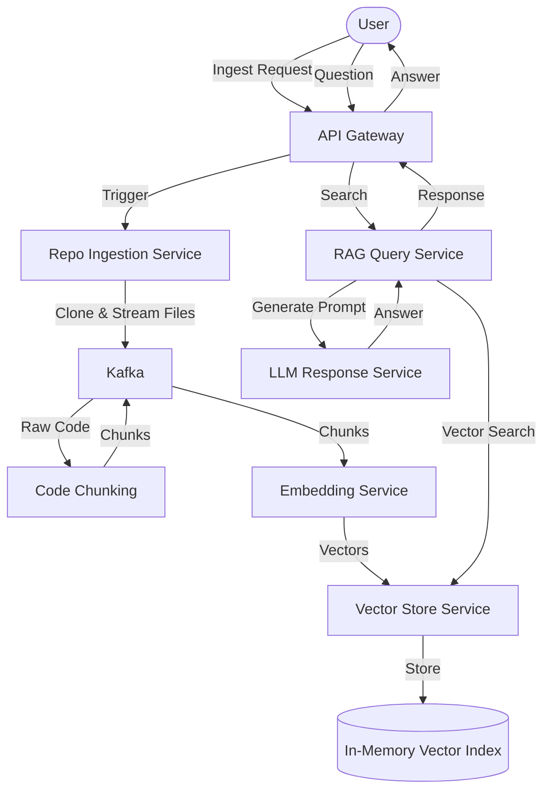

# Architecture Overview

The AI GitHub Codebase Intelligence System is a distributed, event-driven system designed to process and query large code repositories using RAG (Retrieval-Augmented Generation).

## Data Flow

## Services

| Service | Responsibility |
|---------|----------------|
| API Gateway | Entry point for frontend, authentication, and routing |
| Repo Ingestion | Clones git repos and produces raw file events to Kafka |
| Code Chunking | Splits files into logical pieces for embedding |
| Embedding | Converts text chunks into high-dimensional vectors |
| Vector Store | Manages storage and retrieval of vectors |
| RAG Query | Coordinates searching and LLM prompt construction |
| LLM Response| Interface with LLM providers (e.g. OpenAI) for generation |

## Kafka Topics

- `repo-cloned`: emitted when a repository has been cloned and is ready for parsing.
- `file-chunked`: emitted for each semantic/logical code chunk generated by chunking.
- `embedding-ready`: emitted when embedding generation and vector upsert completes.
